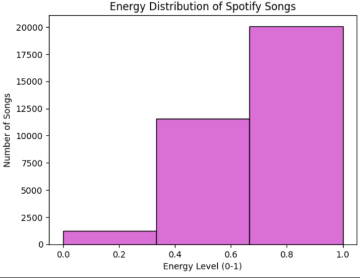
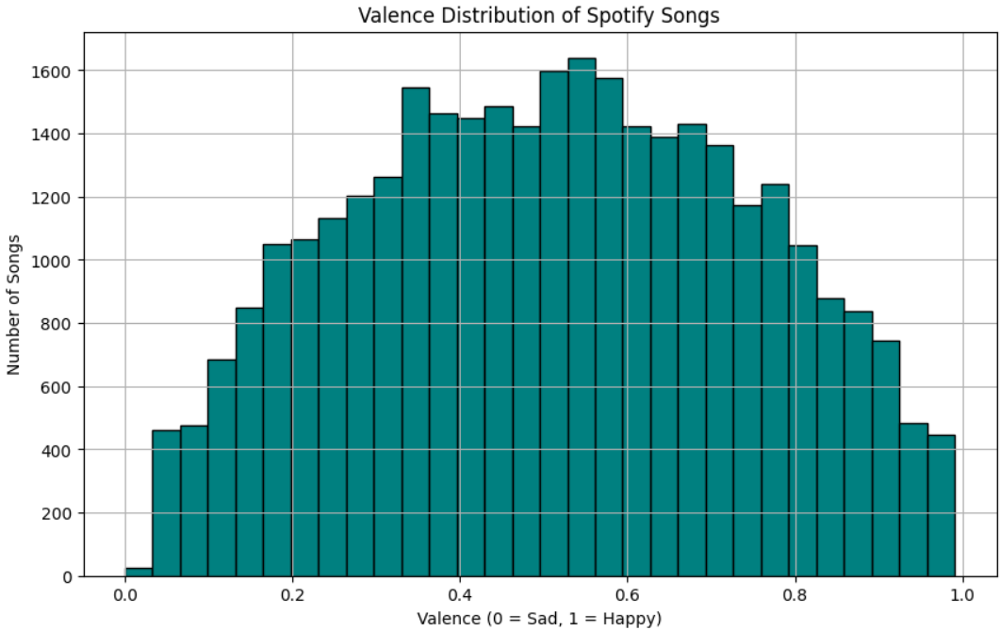
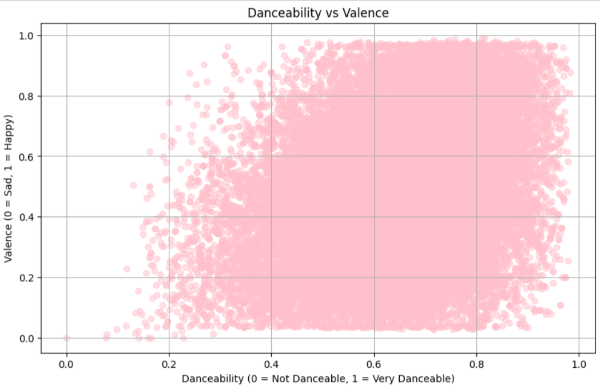
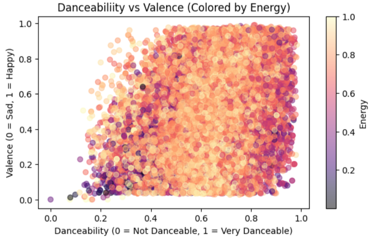

#  Exploring Spotify Audio Features

This is a beginner-friendly data analysis project that explores the relationship between **danceability**, **valence** (musical happiness), and **energy** in songs using a real-world Spotify dataset.

We visualized key audio features to identify patterns in music, using color to represent energy and scatter plots to show feature relationships.

##  Tools & Libraries

- Python (Google Colab)
- pandas
- matplotlib

##  What’s Inside

- Summary statistics for `danceability`, `valence`, and `energy`
- Histograms showing the distribution of each feature
- A scatter plot with color-coded energy to compare `danceability` vs `valence`
- Interpretations and observations on emotional + rhythmic content in music

Here are some example visualizations from the analysis:

##  What I Learned

- High danceability doesn't always mean high happiness
- Energy level adds an extra dimension to understanding music mood
- Scatter plots and histograms can reveal hidden musical trends

##  File Info

- `SpotifyDataSet.ipynb`: Google Colab notebook containing the analysis

## How to Run

1. Click on `SpotifyDataSet.ipynb` link above.
2. Click **Open in Colab** (top bar).
3. Run all cells in order — no external API keys needed.
